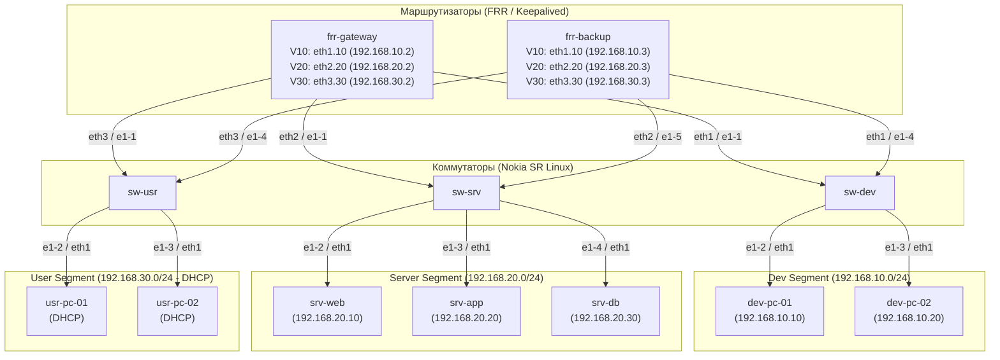

# Содержание

1. [[#Введение]]
2. [[#Базовый containerlab]]
    - [[#Определение и предназначение]]
    - [[#Создание собственной топологии]]
    - [[#Запуск и тестирование]]
3. [[#Реализация корпоративной сети]]
    - [[#Схема сети и адресация]]
    - [[#Базовая топология с линками]]
    - [[#Расширение топологии]]
        - [[#Конфигурации конечных устройств]]
        - [[Конфигурация свитчей]]
        - [[#Конфигурация маршрутизаторов]]
            - [[#Базовая настройка шлюза]]
	            - [[#Разбор конфигурации]]
	            - [[#Тестирование связности]]
            - [[#Настройка DHCP и DNS]]
            - [[#Конфигурируем VRRP]]
	            - [[#Немного теории о VRRP]]
	            - [[#Добавляем VRRP в конфигурацию]]
	            - [[#Тестирование работы протокола]]
        - [[#Настраиваем firewall]]
	        - [[#Устанавливаем правила]]
	        - [[#Тестируем firewall]]
4. [[#Заключение и следующие планы]]
# Введение

Можно вечно изучать теорию сетей, открывать новые для себя протоколы маршрутизации или решения о том, как обезопасить свой сетевой сектор. Но ничто не дает такого глубокого понимания, как построение своей собственной виртуальной лаборатории. Когда теория сталкивается с реальностью настройки интерфейсов, таблиц маршрутизации и отладки пакетов, всё встает на свои места.

В этой статье мы разберем, как с помощью Containerlab и легковесных Linux-контейнеров собрать полноценную многосегментную сетевую лабораторию прямо на своем ноутбуке. Мы объединим маршрутизацию на FRRouting, автоматическую раздачу адресов через DHCP, DNS-резолвинг и базовую фильтрацию трафика в один компактный декларативный файл — и все это без лишней боли и сложных графических интерфейсов. 


Перед прочтением настоятельно рекомендуется изучить: команду ip и базовое сетевое взаимодействие. Хоть данная статья и является обучающией, но если бы пришлось описывать и базу сетей, она бы затянулась на часы прочтения. Тут мы сделаем акцент на практику и проектирование. Удачного прочтения!

# Базовый containerlab

## Определение и предназначение

Инструментом, с помощью которого мы будем строить сетевую архитектуру стал **containerlab**. Разработчик проекта дает очень подробное и краткое определение  того, чем является его инструмент на официальном [сайте](https://containerlab.dev/):

> **Containerlab** — это инструмент с открытым исходным кодом от разработчиков Nokia SR Linux, предназначенный для быстрого создания и управления виртуальными сетевыми лабораториями на базе контейнеров. Он позволяет описывать сложные сетевые топологии в виде простого YAML-файла и разворачивать их с помощью Docker без тяжеловесных виртуальных машин. 

Если описать подробнее, то clab позволяет нам уйти от стандартных и при этом тяжеловесных EVE-NG и GNS3 в сторону легковесных контейнеров и создавать целые сети прямо там. A декларативный подход проекта к использованию `*clab.yml` конфигурации в качестве описания топологии позволяет автоматизировать наши стенды, что сильно упрощает как трайблшутинг, так и сам процесс проектирования.

Для ознакомления с синтаксисом и логикой сетевых топологий создадим базовый проект, состоящий из двух хостов соединеных напрямую между собой. Cначала я предоставлю сам файл, а потом посторочно разберем его состовляющую  и проверим работу.

## Создание собственной топологии

Как было сказано ранее , весь процесс нашего проектирования будет завязан на написании `yaml` конфигураций. Если вы ранее уже были знакомы с докером или просто писали конфигурации похожего типа, то логику вы усвоите быстро. Если же данный формат файла для вас нов, то YAML-конфигурации — это текстовые файлы с древовидным, многоуровневым синтаксисом, где каждый новый отступ (уровень) определяет вложенные параметры, объекты и свойства для настройки системы. Например, наша обучающая топлогия будет выглядеть следующим образом:

```yaml
name: 01-two-hosts

topology:
  nodes:
    pc-01:
      kind: linux
      image: wbitt/network-multitool:3.22.2
      exec:
        - ip addr add 192.168.1.2/24 dev  eth1
        - ip link set eth1  up

    pc-02:
      kind: linux
      image: wbitt/network-multitool:3.22.2
      exec:
        - ip addr add 192.168.1.3/24 dev  eth1
        - ip link set eth1  up

  links:
    - endpoints: ["pc-01:eth1", "pc-02:eth1"]

```

Разберем подробную каждую опцию:
1. `name: ...` - имя нашей топологии, можно выбрать любое, влияет только на то, как будут отображаться наши контейнеры в системе;
2. `topology` - флаг начала нашей сетевой топологии;
3. `nodes` - задает начало описание наших нод / контейнеров / виртуальных устройств. Назвать можно по разному:
	1. `pc-01` и `pc-02` - имена нод, после них следует уже следуют подробные инструкции для контейров;
	2. `kind` - вид нашей ноды. Тк containerlab заточен под контейнеры, то фактически может запустить абсолютно любой образ (будь то nokia_sr, cisco, mikrotik или что то иное), поэтому мы явно указываем, что собираемся использовать.
	3. `image `- непосредственно образ системы. Образы containerlab берет из [DockerHub](https://hub.docker.com/).  Можете найти любой образ, какой вам нужен и подставить его в свою топологию.
	4. `exec` - указание системе, что ей сделать во время запуска. В данном случае мы хотим явно указать статические ip адреса, которые не будут меняться при повторном запуске стенда. 
4. `links` - последний блок топологии, который отвечает за соединения хостов между собой в формате `[имя хоста]:[интерфейс]`. Тут у нас маленькая топология из всего двух устрйоств, поэтому соедним их по `eth1`. Важное уточнение: containerlab резевирует интерфейс `eth0` за собой, чтобы наши контейнеры не были полностью изолированы а имели выход в сеть, а также, для подключения к ним по telnet / ssh. Именно поэтому мы всегда начинаем соединять линки только с `eth1` или другого интерфейса в зависимости от нашего образа. 

Это не все опции, которые мы можем использовать. Containerlab предоставляет большой спектр декларативных настроек наших лабораторий: от конфигурации того, сколько памяти и ядер будет выделено под каждую ноду, до создания и менеджмента целых сетей. 

## Запуск и тестирование

Когда тополгия собрана, можем запустить её и убедиться в корректой работе. Запуск происводиться комагдой `sudo containerlab deploy -t [имя топологии]`. Выполним ее и посмотрим на вывод. 

==СЮДА КАРТИНКУ ТЕРМИНАЛА БУДЕМ ВСТАВЯЛТЬ== 

Запуск прошел успешно, но как мы видим хосты всё еще отображаются как `health: starting`, поэтому подождем некоторое время (в рамках этой работы не займет больше 10-30 секунд) и проверим состояние образов командой `sudo containerlab inspect -t [имя топлогии]`.


==СЮДА КАРТИНКУ ТЕРМИНАЛА БУДЕМ ВСТАВЯЛТЬ== 

Теперь все готово и мы можем зайти в наши контейнеры. Сделать это можно разными способами: ssh, telnet, docker. Самым гарантированным способом всегда будет являться запуск через докер. Заходить будем в оболочку `sh` , где проверим полученные ip адреса и заустим пинг устройств.

==СЮДА КАРТИНКУ ТЕРМИНАЛА БУДЕМ ВСТАВЯЛТЬ== 

Как мы видим пинг выполнился удачно, оба хоста отвечают друг другу, а значит базовую топологию со статической адрессацией построить мы смогли. Это очень вожно для последующих наших действий, ведь мы собираемся построить свой мини корпоративный стенд, с несколькими подсетями , тегированием пакетов , а также протоколом, отвечающим за работу роутера в  случае его "падения" в процессе атаки или же из-за иного фактора. 

# Реализация корпоративной сети

Теперь пристуим к главной сути статьи и ее самой интересной части - реализации 
нашей сети. Она не будет большой и накрученной, ее суть заключается в том, чтобы уместить внутри себя основные принципы построения базовых корпоративных сетей , чтобы начинающие сетевые инженеры, сетевые администраторы и прочие люди, чьи интересы лежат в рамках сетей и администрирования, смогли увидеть, как такое можно реализовать на собственном компьютере. 

Мы построим сеть с использованием подсетей, разделением сегментов под отделы, используем dhcp для выдачи ip адресов, настроим правила firewall, а также реализуем довольно интересную и полезную фишку, а именно **VRRP** протокол, который обеспечит безотказность нашего шлюза. Надеюсь вы без проблем дошли до этого момента, пристуим к проектированию.
## Схема сети и адресация

В нашей топлогии мы будем использовать звезду, она дает удобный контроль над инфраструктурой и не требует большого количества соединенией. Она состоит из:
1. Двух маршрутизаторов `frr`, что позволит нам использовать как декларативные настройки в формате `.conf`, где синтаксис смежен в cisco like, так и обычные линуксовые команды. Отработка написания таких конфигураций даст большой шаг в понимании того, как настраиваются маршрутизаторы, ведь всегда главное понять логику, а синтаксис уже приживется сам после непосредственного использования оборудования. Оба роутера будут использовать технологию keepalived, что обеспечит отказоустойчивость всех сетевых сегментов. Также маршрутизаторы будут выполнять роль фаервола, ограничивая права входящих и исходящих пакетов;
2. Трех маршрутизаторов `nokia_sr`, которые фактически являются реальными образами свичей от циско. Они разделят нашу сеть на три главные подсети: отдел разработки, серверная и пользовательский сегмент. Кроме того мы настроим тегирование пакетов и обязательно проверим то, что когда пакет будет идти в сеть, он будет помечен тегом своего vlan. Например vlan 10 и тд;
3. Конечных устройств:
	1. Отдел разработки - компьютеры разработчиков;
	2. Серверный отдел - там будут находиться : база данных, бекенд и фронтенд сервер, но реализовано это будет в другой статье. Если вам будет интересно, как можно будет расширять этот стенд, добавляя все новые фичи , то укажите это в коментариях;
	3. Клиентский отдел - клиентские компьютеры, которые будут сильно ограничены в правах , а также будут получать ip адреса по dhcp.

Все устройства кроме клиентского отдела будут иметь статические адреса. Опишем таблицу адрессации, а также краткую сводку по образам которые будем использовать и их предназначению.

| имя         | интерфейс                          | ip/mask                                         | vlan              | образ                          | предназначение                                                                                                                   |
| ----------- | ---------------------------------- | ----------------------------------------------- | ----------------- | ------------------------------ | -------------------------------------------------------------------------------------------------------------------------------- |
| frr-gateway | eth1 - dev  eth2 - srv  eth3 - usr | 192.168.10.2/24 192.168.20.2/24 192.168.30.2/24 | 10      20     30 | quay.io/frrouting/frr:10.5.1   | Является главным маршрутизатором в нашей топологии                                                                               |
| frr-backup  | eth1 - dev  eth2 - srv  eth3 - usr | 192.168.10.2/24 192.168.20.2/24 192.168.30.2/24 | 10      20     30 | quay.io/frrouting/frr:10.5.1   | Вспомогательный маршрутизатор, который берет на себя роль шлюза по умолчанию, если основной по какой-либо причине вышел из строя |
| sw-dev      | -                                  | -                                               | -                 | ghcr.io/nokia/srlinux          | Свитч отдела разработки                                                                                                          |
| sw-srv      | -                                  | -                                               | -                 | ghcr.io/nokia/srlinux          | Свитч отдела серверной                                                                                                           |
| sw-usr      | -                                  | -                                               | -                 | ghcr.io/nokia/srlinux          | Свитч отдела клиентов                                                                                                            |
| dev-pc-01   | eth1                               | 192.168.10.10/24                                | 10                | wbitt/network-multitool:3.22.2 | Пк отдела разработки                                                                                                             |
| dev-pc-02   | eth1                               | 192.168.10.20/24                                | 10                | wbitt/network-multitool:3.22.2 | Пк отдела разработки                                                                                                             |
| srv-web     | eth1                               | 192.168.20.10/24                                | 20                | nginx:alpine                   | Фронтенд сервер на ngnix                                                                                                         |
| srv-app     | eth1                               | 192.168.20.20/24                                | 20                | wbitt/network-multitool:3.22.2 | Бекенд сервер                                                                                                                    |
| srv-db      | eth1                               | 192.168.20.30/24                                | 20                | wbitt/network-multitool:3.22.2 | База данных                                                                                                                      |
| usr-pc-01   | eth1                               | 192.168.30.10/24                                | 30                | wbitt/network-multitool:3.22.2 | Пк клиентского отдела                                                                                                            |
| usr-pc-02   | eth1                               | 192.168.30.20/24                                | 30                | wbitt/network-multitool:3.22.2 | Пк клиентского отдела                                                                                                            |

И теперь представлю  сам график нашей сетевой топологии:


## Базовая топология с линками

Когда адресация и логика архитектуры нам понятно можем приступить к написанию топологии, сейчас соберем лишь образы и установим линки. Ранее мы уже собирали базовую топологию, эта же ничем отличаться не будет. По таблице адрессации добавляем наши ноды и соединяем линками, но кое что новое мы добавим. Для того , чтобы не писать каждый раз образы системы , которые повторяются на большинства хостов, предлегаю выделить отдельные группы. Так будет выглядеть наша топология, проблем с ее понимаем быть не должно:

```yaml
name: lab-dhcp-dns
topology:

  groups:
    routers:
      kind: linux
      image: quay.io/frrouting/frr:10.5.1 
    switches:
      kind: nokia_srlinux
      image: ghcr.io/nokia/srlinux
    hosts:
      kind: linux
      image: wbitt/network-multitool:3.22.2

  nodes:
    frr-gateway:
      group: routers
 
    frr-backup:
      group: routers

    # --- Dev segment ---
    sw-dev:
      group: switches

    dev-pc-01:
      group: hosts

    dev-pc-02:
      group: hosts

    # --- Server segmnet ---
    sw-srv:
      group: switches

    srv-web:
      kind: linux
      image: nginx:alpine

    srv-app:
     group: hosts

    srv-db:
      group: hosts

    # --- User segment ---
    sw-usr:
      group: switches

    usr-pc-01:
      group: hosts

    usr-pc-02:
      group: hosts

  links:
    - endpoints: ["frr-gateway:eth1", "sw-dev:e1-1"]
    - endpoints: ["frr-gateway:eth2", "sw-srv:e1-1"]
    - endpoints: ["frr-gateway:eth3", "sw-usr:e1-1"]

    - endpoints: ["frr-backup:eth1", "sw-dev:e1-4"]
    - endpoints: ["frr-backup:eth2", "sw-srv:e1-5"]
    - endpoints: ["frr-backup:eth3", "sw-usr:e1-4"]

    - endpoints: ["sw-dev:e1-2", "dev-pc-01:eth1"]
    - endpoints: ["sw-dev:e1-3", "dev-pc-02:eth1"]

    - endpoints: ["sw-srv:e1-2", "srv-web:eth1"]
    - endpoints: ["sw-srv:e1-3", "srv-app:eth1"]
    - endpoints: ["sw-srv:e1-4", "srv-db:eth1"]

    - endpoints: ["sw-usr:e1-2", "usr-pc-01:eth1"]
    - endpoints: ["sw-usr:e1-3", "usr-pc-02:eth1"]

```

Запускаем нашу топологию и ждем , пока все устройства запустятся. После этого предлагаю посмотреть график нашей сети. Вводим команду `sudo containerlab graph` , которая дает нам ссылки. Переходим по первой и попадем на страницу графического отображения нашей топологии. Важно держать команду запушенной, после ее завершения, открытый ей порт, перестает работать:

==СЮДА КАРТИНКУ ГРАФИКА БУДЕМ ВСТАВЯЛТЬ== 

Топлогия успешно запустилась, значит мы можем приступать к детальной настройке каждого из контейнеров.
## Расширение топологии

В рамках уже этого , блока начинается настоящее админстрирование, мы настроим как статическую , так и динамическую адрессацию, забронируем порты на наших шлюзах и выполним реализацию VRRP.
### Конфигурации конечных устройств

Предлагаю начать с самого простого - настройки конечных устройств. Тут все довольно интуитивно понятно. Нам требуется назначить на них статические ip адреса, поднять интерфейс,  установить шлюз по умолчанию, для клиентских пк получить ip адреса по dhcp, а также установить наш шлюз в качестве dns сервера (наш шлюз будет также представлять из себя dns сервер) при помощи `exec` в конфигурации каждого из хостов. Все это мы делали в изучении базовой топологии. Продемонистрирую лишь два хоста : пк отдела разработки и пк клиентского отдела, все остальные хосты конфигурируются абсолютно также:
```yaml
dev-pc-01:
	# включаем в группу хостов
	group: hosts
	exec:
		# установка статического адреса
		- ip addr add 192.168.10.10/24 dev eth1 
		# поднятие интерфейса
		- ip link set eth1 up
		#  замена шлюза п умолчанию
		- ip route replace default via 192.168.10.1 dev eth1 
		# фиксируем наш шлюз как днс сервер 
		- sh -c 'echo "nameserver 192.168.10.1" > /etc/resolv.conf'
		  
usr-pc-02:
	# включаем в группу хостов
    group: hosts
    exec:
	    # усыпляем контейнер на 10 секунд, в ожидании запуска dhcp сервера
        - sleep 10
        # подниманием интерфейс
        - ip link set eth1 up
        # получаем ip адрес по dhcp на интерфейс eth1
        - udhcpc -i eth1
        # заменяем шлюз по умолчанию
        - ip route replace default via 192.168.30.1 dev eth1
```

И так необходимо проконфигурировать каждый из хостов. Изменяться будет только шлюз по умолчанию и ip адрес в зависимости от подсети, в которого находиться устройство.
### Конфигурация свитчей

Далее переходим к настройке наших свитчей. Роль коммутаторов в нашей архитектуре проста и классична: они объединяют устройства в единые сегменты (мосты) и выполняют тегирование (trunking) на портах, смотрящих на шлюзы, чтобы разделить разные подсети по своим VLAN, и аксесс-порты (access) для подключения конечных хостов. Конфигурация будет описана в стандартных для nokia_cr `.cli` файлах, их синтаксис достаточно прост для понимания. Приведем  конфигурацию одного из свитчей, но если у вас остаются вопросы , то можете глянуть документацию [тут](https://documentation.nokia.com/srlinux/).

```cli
set / interface ethernet-1/1 admin-state enable 
set / interface ethernet-1/1 vlan-tagging true
set / interface ethernet-1/1 subinterface 10 type bridged 
set / interface ethernet-1/1 subinterface 10 vlan encap single-tagged vlan-id 10

set / interface ethernet-1/2 admin-state enable
set / interface ethernet-1/2 vlan-tagging true
set / interface ethernet-1/2 subinterface 0 type bridged 
set / interface ethernet-1/2 subinterface 0 vlan encap untagged

set / interface ethernet-1/3 admin-state enable
set / interface ethernet-1/3 vlan-tagging true
set / interface ethernet-1/3 subinterface 0 type bridged
set / interface ethernet-1/3 subinterface 0 vlan encap untagged

set / interface ethernet-1/4 admin-state enable 
set / interface ethernet-1/4 vlan-tagging true
set / interface ethernet-1/4 subinterface 10 type bridged 
set / interface ethernet-1/4 subinterface 10 vlan encap single-tagged vlan-id 10

set / network-instance vlan-10 type mac-vrf 
set / network-instance vlan-10 admin-state enable
set / network-instance vlan-10 interface ethernet-1/1.10
set / network-instance vlan-10 interface ethernet-1/2.0
set / network-instance vlan-10 interface ethernet-1/3.0
set / network-instance vlan-10 interface ethernet-1/4.10
```

Тут мы выполняем три ключевых действия:
1. Поднимаем интерфейсы с установкой режима моста. За это отвечают опции `admin-state enable ` и  `type bridged`;
2. На `e1-1` и  `e1-4` устаналиваем транк порты, которые выполняют тегирование, выполняют это опции `vlan-tagging true`, разрешающая тегирование , и `vlan encap single-tagged vlan-id 10`, устанавливающая id для порта. Там где тегирование не нужно явно это указываем;
3. Объединяем все наши порты в виртуальный домен с id подсети, указав `type mac-vrf `,  и добавляем все наши интерфейсы. 

Аналогичным образом настраиваются и остальные коммутаторы нашей сети (`sw-srv` и `sw-usr`), меняются лишь идентификаторы VLAN и привязки портов под конкретные подсети. В который раз можем заметить , как декларативный подход помогает автоматизировать проектирование домашних лабораторий. Даже если что то сломается, или упадет, мы сможем просто скорректировать один файл, который находиться прямо на нашем хосте, что сильно упрощает трайблшутинг. Фундамент второго уровня готов. Шагаем дальше — настраиваем маршрутизацию, правила межсетевого экрана и механизмы высокой доступности.
### Конфигурация маршрутизаторов

Мы закончили почти большую часть и подошли к самому сложному заданию, настроить наши шлюзы. Они будут выполнять много работы и служить полноценными серверами и будут "головой" нашей сети. Нам потребуется не только настроить их как шлюзы , но и поднять dhcp и dns сервер, а также vrrp. Но не стоит боятся, если делать поэтапно , то все выглядит довольно последовательно и логично. Приступим.

#### Базовая настройка шлюза
##### Разбор конфигурации

Для минимальной конфигурации наш шлюз должен поднять свои порты и назначить им адресса, это мы и сделаем. После конфигурации свитчей, мы уже должны разобраться в логике написания конфигурации и тут она также не представляет труда. Выбираем интерфейс и затем назначем адрес.
```conf
frr version 10.5.1 -- указываем версию
frr defaults traditional -- консервативное поведение 
hostname frr-gateway -- указываем имя
log stderr -- логируем ошибки
!
interface eth1 -- выбираем интерфейс
    description Trunk to SW-DEV (VLAN 10) -- описание
    exit
!
interface eth2
    description Trunk to SW-SRV (VLAN 20)
    exit
!
interface eth3
    description Trunk to SW-USR (VLAN 30)
    exit
!
interface eth1.10 -- тут уже для выбранного интерфейса выбираем его vlan id
    description Gateway IP for DEV Segment (VLAN 10)
    ip address 192.168.10.1/24 -- назначем ip
    exit
!
interface eth2.20
    description Gateway IP for SERVER Segment (VLAN 20)
    ip address 192.168.20.1/24
    exit
!
interface eth3.30
    description Gateway IP for USER Segment (VLAN 30)
    ip address 192.168.30.1/24
    exit
!
ip forwarding
!
line vty
    exit
```

Далее внедрняем нашу конфигурацию, при помощи новой для нас опции `binds`, а также поднимаем интерфейсы и их адреса:
```
frr-gateway:
      group: routers
      binds:
        - configs/frr.conf:/etc/frr/frr.conf
      exec:
        - ip link add link eth1 name eth1.10 type vlan id 10
        - ip link add link eth2 name eth2.20 type vlan id 20
        - ip link add link eth3 name eth3.30 type vlan id 30
        - ip link set eth1.10 up
        - ip link set eth2.20 up
        - ip link set eth3.30 up
        - ip addr add 192.168.10.1/24 dev eth1.10
        - ip addr add 192.168.20.1/24 dev eth2.20
        - ip addr add 192.168.30.1/24 dev eth3.30
```

В секции `exec` для шлюза `frr-gateway` мы подготавливаем операционную систему Linux к работе: с помощью команд `ip link` создаем виртуальные VLAN-интерфейсы (`eth1.10`, `eth2.20`, `eth3.30`) на базе физических портов, поднимаем их и присваиваем им шлюзовые IP-адреса через `ip addr add`. Это разделение критически важно: в блоке `exec` мы настраиваем сетевой уровень ОС Linux (создаем «физику» и адресацию), а демон FRR автоматически подхватывает эти готовые интерфейсы через системные сокеты и использует их для маршрутизации трафика между нашими изолированными сегментамию. После этого мы можем перезапускать топологию, заходить в контейнеры и проверять что всё соединено корректно, используя команду `ping`.  Важное уточнение: для успешного запуска закоментируем строку выдачи ip по dhcp. Пока наш dhcp сервер не настроен эта команда попросту зависнет, не дав топологии запуститься.

##### Тестирование связности

Теперь перейдем к проверке, наша цель - провести `ping` для dev и srv сегмента, тем самым убедиться что свитчи и шлюзы выполняют свою работу. Зайдем в контейнеры как делали это ранее и пропингуемся:

==ТУТ ВСТАВЛЯЕМ СКРИН ТЕРМИНАЛА==

как мы видим, адреса назначились правильно и пакеты ходят между сетями, первую задачу, которую выполняем шлюз мы выполнили.

#### Настройка DHCP и DNS

Теперь переходим к конфигурации dhcp и dns сервера, который мы посторим с использованием `dnsmasq` - стандартном для linux инструменте настройки dns и dhcp. Держим в голове, что динамически получать адреса будет только vlan 30, то есть клиентский отдел. Тут нам необходимо выполнить три действия: прописать конфигурацию, записать ее в `binds` и запустить сервер, а также запросить адреса с пк клиентов (то что мы закоментировали). 

Начнем писать конфигурацию и внедрим ее в топологию: 

```conf
# явно указываем порты, с которых принимать запросы на dhcp и dns
listen-address=127.0.0.1,192.168.10.1,192.168.20.1,192.168.30.1

# указываем интерфейс для которого будет арендовать адреса
interface=eth3.30

# игнорируемые порты
no-dhcp-interface=eth1.10
no-dhcp-interface=eth2.20

# промежуток выдачи адресов: начальный адрес, конечный, маска и время аренды
dhcp-range=192.168.30.100, 192.168.30.200, 255.255.255.0, 12h

# указываем шлюз , а также dns сервер
dhcp-option=option:router,192.168.30.1
dhcp-option=option:dns-server,192.168.30.1

# создаем домен и указваем его как локальный, 
# чтобы при доступе шлюз не искал его в сети интернет по умолчанию
domain=corp.local
local=/corp.local/

# записываем адреса и днс имена для хостов
host-record=gateway.corp.local,192.168.30.1
host-record=web.corp.local,192.168.20.10
host-record=app.corp.local,192.168.20.20
host-record=db.corp.local,192.168.20.30
```

```yaml
frr-gateway:
      group: routers
      binds:
        - configs/frr/frr.conf:/etc/frr/frr.conf
        # подключаем файл
        - configs/frr/dnsmasq.conf:/etc/dnsmasq.conf
      exec:
        - ip link add link eth1 name eth1.10 type vlan id 10
        - ip link add link eth2 name eth2.20 type vlan id 20
        - ip link add link eth3 name eth3.30 type vlan id 30
        - ip link set eth1.10 up
        - ip link set eth2.20 up
        - ip link set eth3.30 up
        - ip addr add 192.168.10.1/24 dev eth1.10
        - ip addr add 192.168.20.1/24 dev eth2.20
        - ip addr add 192.168.30.1/24 dev eth3.30
        - apk add --no-cache dnsmasq
        # запускаем dhcp и dns сервер 
        - dnsmasq -C /etc/dnsmasq.conf
```

После чего снова заходим в контейнеры, но на этот раз в клиентский отдел и выполняем две вещи: пингуем все конечные устройства и проверяем работу dns, используя все те же команды. 

==ТУТ ВСТАВЛЯЕМ СКРИН ПИНГА КЛИЕНТОВ==

Но по соображением безопасности клиенты не должны иметь доступ к пингу по днс серверами, поэтому для них мы не указываем nameserver и проверять днс будем с пк отдела разработки.

==ТУТ ВСТАВЛЯЕМ СКРИН ПИНГА ДНС==

#### Конфигурируем VRRP

##### Немного теории  о VRRP

И наконец-то мы с вами дошли до финальной точки нашей лаборатории — настройки защиты от сбоев. В реальной жизни внезапное падение единственного шлюза означает мгновенный паралич всей сети: компьютеры теряют связь с внешним миром, базы данных становятся недоступны, а администраторы начинают пить успокоительное.

Чтобы избежать этой уязвимости, сетевые инженеры используют механизмы высокой доступности (High Availability). Главным инструментом здесь выступает **VRRP (Virtual Router Redundancy Protocol)** — стандартный протокол (описанный в RFC 5798), который позволяет нескольким физическим маршрутизаторам работать как единый отказоустойчивый шлюз.

 Как работает VRRP вкратце:

- **Виртуальный IP-адрес (VIP):** Все конечные хосты в сегменте настраивают в качестве шлюза по умолчанию не реальный адрес конкретного роутера, а общий виртуальный адрес (в нашей архитектуре это тот самый заветный адрес с `.1` на конце).
- **Распределение ролей (Master и Backup):** Физические маршрутизаторы делятся на роли. Основной узел (`frr-gateway`) получает статус **Master** — он обрабатывает весь реальный трафик и отвечает на ARP-запросы. Второй узел (`frr-backup`) находится в режиме **Backup** и просто «слушает» эфир.
- **Автоматический фейловерок (Failover):** Мастер регулярно шлет служебные multicast-сообщения (анонсы). Если основной роутер выходит из строя или теряет связь, резервный узел перестает получать эти пакеты, мгновенно забирает виртуальный IP на себя и бесшовно принимает весь клиентский трафик. Для пользователей сети этот переход происходит за считанные секунды и абсолютно незаметно.

Для реализации этой магии в Linux-окружении мы будем использовать связку утилиты **Keepalived** и нашего демона маршрутизации **FRR**. Давайте посмотрим, как это настраивается на практике.

##### Добавляем VRRP в конфигурацию

Начнем с написания декларативной конфигурации, она и будет управлять нашей утилитой keepalived. Приведу реализацию лишь одного порта с главного шлюза и резервного, ведь меняется везде лишь vlan id, а все остальное остается таким же. 

Начнем с основного шлюза. Мы указываем состояние `MASTER`, которое указывает на то, что данное устройство является главным. Кроме того мы указываем виртуальный адрес, который выдается устройству, его интерфейс, тег и приоритет.
```conf
vrrp_instance VI_10 {
    state MASTER
    interface eth1.10
    virtual_router_id 10
    priority 100
    advert_int 1
    authentication {
        auth_type PASS
        auth_pass secpass
    }
    virtual_ipaddress {
        192.168.10.1/24
    }
}
```

С дублирующим устройством всё повторяется, за исключением его состояние. Тут оно меняется на `BACKUP`, а также понижается приоритет устройства.
```conf
vrrp_instance VI_10 {
    state BACKUP
    interface eth1.10
    virtual_router_id 10
    priority 90
    advert_int 1
    authentication {
        auth_type PASS
        auth_pass secpass
    }
    virtual_ipaddress {
        192.168.10.1/24
    }
}
```

И последнее , что мы должны сделать - внедрить всё это в топологию. Вспоминая, то что vrrp выдает виртуальные адреса, изменим также и стандартные ip адреса шлюза. В настройке хостов ничего менять не придется, протокол отрабает и заменит адреса как требуется. Не забываем создать `frr.conf` для frr-backup, он будет абсолютно таким же как и для основного шлюза. ведь он полностью его копирует. Теперь наша конфигурация шлюзов обретает почти готовый вид:

```yaml
frr-gateway:
      group: routers
      binds:
        - configs/frr-gateway/frr.conf:/etc/frr/frr.conf
        - configs/frr-gateway/dnsmasq.conf:/etc/dnsmasq.conf
        - configs/frr-gateway/keepalived-gw.conf:/etc/keepalived/keepalived.conf
      exec:
        - ip link add link eth1 name eth1.10 type vlan id 10
        - ip link add link eth2 name eth2.20 type vlan id 20
        - ip link add link eth3 name eth3.30 type vlan id 30
        - ip link set eth1.10 up
        - ip link set eth2.20 up
        - ip link set eth3.30 up
        - apk add --no-cache dnsmasq iptables keepalived
        - dnsmasq -C /etc/dnsmasq.conf
        - ip addr add 192.168.10.2/24 dev eth1.10
        - ip addr add 192.168.20.2/24 dev eth2.20
        - ip addr add 192.168.30.2/24 dev eth3.30
        - keepalived -f /etc/keepalived/keepalived.conf
        
frr-backup:
      group: routers
      binds:
        - configs/frr-backup/frr.conf:/etc/frr/frr.conf
        - configs/frr-backup/keepalived-bk.conf:/etc/keepalived/keepalived.conf
      exec:
        - ip link add link eth1 name eth1.10 type vlan id 10
        - ip link add link eth2 name eth2.20 type vlan id 20
        - ip link add link eth3 name eth3.30 type vlan id 30
        - ip link set eth1.10 up
        - ip link set eth2.20 up
        - ip link set eth3.30 up
        - apk add --no-cache iptables keepalived
        - ip addr add 192.168.10.3/24 dev eth1.10
        - ip addr add 192.168.20.3/24 dev eth2.20
        - ip addr add 192.168.30.3/24 dev eth3.30
        - keepalived -f /etc/keepalived/keepalived.conf
```

##### Тестирование работы протокола

После перезапуска топологии проведем стресс-тест протокола VRRP: запустим непрерывный пинг до внешнего узла и в процессе намеренно остановим основной маршрутизатор.

==СЮДА ВСТАВИТЬ ВИДЕО ТОГО КАК ШЛИ ПАКЕТЫ==

Как видно на записи, в момент отключения контейнера `frr-gateway` наблюдается кратковременная пауза в передаче пакетов. Однако уже через секунду-две `frr-backup` фиксирует сбой по тайм-ауту, берет на себя виртуальный IP-адрес шлюза (VIP) и перенаправляет трафик по резервному маршруту, полностью восстанавливая связь. 

#### Настраиваем firewall

##### Устанавливаем правила

Любая, даже самая отказоустойчивая и технологичная сетевая инфраструктура остается уязвимой, если в ней отсутствует жесткий контроль транзитного трафика. В нашей виртуальной корпоративной сети сосуществуют принципиально разные зоны: доверенный отдел разработки, изолированный серверный сегмент и пользовательская сеть с динамической выдачей адресов. Чтобы исключить хаотичное перемещение пакетов между ними, предотвратить потенциальные угрозы и защитить критически важные узлы, нам необходим межсетевой экран.

Для реализации этой задачи мы задействуем встроенный в ядро Linux инструмент фильтрации — утилиту `iptables`, настроив её на наших шлюзах. Ниже приведены 7 базовых правил, которые реализуют классические принципы корпоративной безопасности (включая концепцию _Zero Trust_ и изоляцию сегментов):
1. `iptables -A FORWARD -m conntrack --ctstate ESTABLISHED,RELATED -j ACCEPT`.
	Это важнейшее правило, которое позволяет пропускать обратный трафик для уже установленных соединений. Без него компьютеры могли бы отправлять запросы, но ответы от серверов блокировались бы на обратном пути.  Изоляция клиентов от разработчиков:
2. `iptables -A FORWARD -s 192.168.30.0/24 -d 192.168.10.0/24 -j DROP`.
	Клиентскому сегменту (VLAN 30) совершенно незачем иметь доступ к рабочим станциям отдела разработки (VLAN 10). Этим правилом мы жестко пресекаем любые попытки прямого взаимодействия.  Точечный доступ клиентов к WEB-серверу:
3. `iptables -A FORWARD -s 192.168.30.0/24 -d 192.168.20.10 -p tcp --dport 80 -j ACCEPT`.
	Единственное, что нужно пользователям — это доступ к корпоративному порталу. Мы разрешаем трафик только на конкретный IP-адрес фронтенд-сервера (192.168.20.10) и строго по протоколу HTTP (порт 80).  Блокировка остального серверного сегмента для клиентов:
4. `iptables -A FORWARD -s 192.168.30.0/24 -d 192.168.20.0/24 -j DROP`.
	Сразу после разрешения доступа к веб-серверу мы закрываем клиентам доступ ко всей остальной серверной сети (VLAN 20). Базы данных и бекенд остаются надежно скрыты от рядовых пользователей.  Полный доступ разработчиков к серверам:
 5. `iptables -A FORWARD -s 192.168.10.0/24 -d 192.168.20.0/24 -j ACCEPT`.
	Отдел разработки (VLAN 10) должен иметь возможность свободно подключаться к серверной инфраструктуре для деплоя, настройки и отладки сервисов.  Разрешение ICMP (ping):
6. `iptables -A FORWARD -p icmp -j ACCEPT`.
	Оставляем протокол ICMP открытым для всех сегментов. В условиях корпоративной лаборатории (да и в реальных сетях) возможность пропинговать соседний узел критически важна для диагностики и траблшутинга.  Политика запрета по умолчанию (Default Deny):
7. `iptables -P FORWARD DROP`.
	Фундаментальное правило сетевой безопасности: всё транзитное прохождение пакетов, которое не было явно разрешено предыдущими правилами, должно быть безжалостно отброшено.

Эти правила мы добавляем в блок exec конфигурации нашего frr-gateway с помощью стандартной утилиты iptables. Благодаря тому, что правила считываются сверху вниз, мы смогли реализовать принцип минимальных привилегий (Zero Trust), открыв только необходимые порты и заблокировав всё остальное. 

##### Тестируем firewall

Для верификации корректности функционирования настроенного межсетевого экрана выполним практическую проверку сетевой доступности между изолированными сегментами. Согласно нашей политике безопасности, клиентский сегмент должен быть ограничен в доступе к серверной инфраструктуре, в то время как за отделом разработки сохраняются необходимые сетевые привилегии.

Проверим это с помощью базовой утилиты `ping`, инициируя запросы последовательно из обеих зон:

==СЮДА ВСТАВИТЬ СКРИНШОТ ТЕРМИНАЛА С РЕЗУЛЬТАТАМИ ПИНГА==

Как демонстрируют результаты тестирования, попытка отправки ICMP-пакетов с пользовательского ПК (`usr-pc-01`) на узел серверной подсети приводит к стопроцентной потере пакетов (100% packet loss). Это наглядно подтверждает, что правила `iptables` на шлюзе успешно пресекают неавторизованный транзитный трафик. В то же время аналогичный запрос с рабочей станции разработчика (`dev-pc-01`) выполняется штатно, демонстрируя нулевой процент потерь и подтверждая корректность разрешающих правил для инженерного сегмента.

Подобная дифференциация прав наглядно доказывает эффективность реализованной модели сетевой безопасности. Если вы хотите глубже закрепить материал, вы можете самостоятельно расширить сценарии тестирования, проверив отклик других протоколов и портов в рамках развернутого полигона.

# Заключение и следующие планы 

Подводя итог, можно с уверенностью сказать, что **Containerlab** — это по-настоящему мощный, гибкий и современный инструмент, который полностью меняет подход к проектированию и тестированию сетей. Забыв про неповоротливые графические эмуляторы, мы смогли развернуть полноценную, отказоустойчивую корпоративную инфраструктуру прямо на ноутбуке, объединив маршрутизацию на FRR, динамическую выдачу адресов через DHCP, отказоустойчивость на VRRP и строгую фильтрацию трафика с помощью межсетевого экрана. И всё это — в виде чистого, воспроизводимого декларативного конфигурационного файла, который любой человек сможет скопировать в себе и быстро воссоздать полную работу написанной здесь архитектуры.


(**P.S.** Буду искренне рад вашему фидбеку, конструктивной критике и пожеланиям о том, какие моменты стоило бы изменить или дополнить. Обязательно делитесь в комментариях своими идеями и тем, о чем вам было бы интересно почитать в следующих статьях!

А если вы хотите запустить этот стенд самостоятельно и поэкспериментировать, заглядывайте на мой [GitHub-репозиторий](https://github.com/Hxuwks/dhcp-dns-containerlab) — проект полностью открытый, так что вы можете смело форкать его и развивать на его базе собственную сетевую инфраструктуру.)